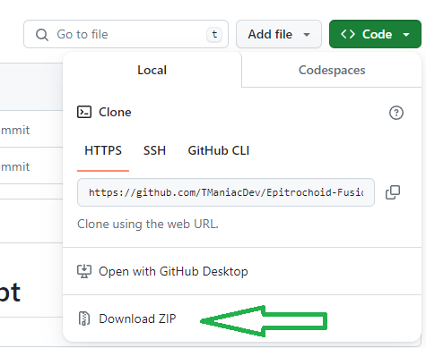
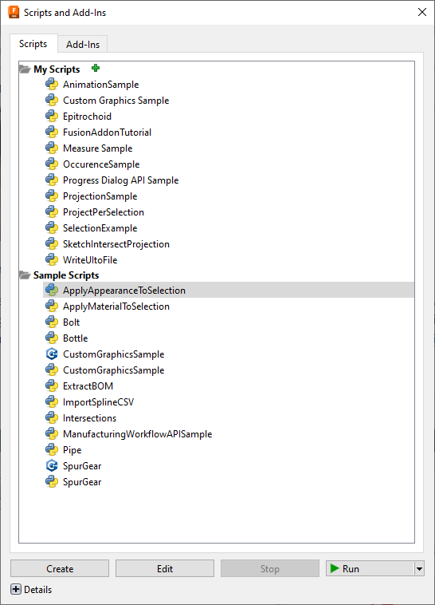

# Epitrochoid Fusion360 Script

## What is an Epitrochoid?
Best is to take a look on the [Wikipedia](https://en.m.wikipedia.org/wiki/Epitrochoid)

https://en.m.wikipedia.org/wiki/Epitrochoid#/media/File%3AEpitrochoidIn3.gif

## How to install the script
The script is a Python script.
First you must donwload the source code.

In Fusion360 go to the Utilities Tab and start the script manager

Inside the Manager klick at the green plus

