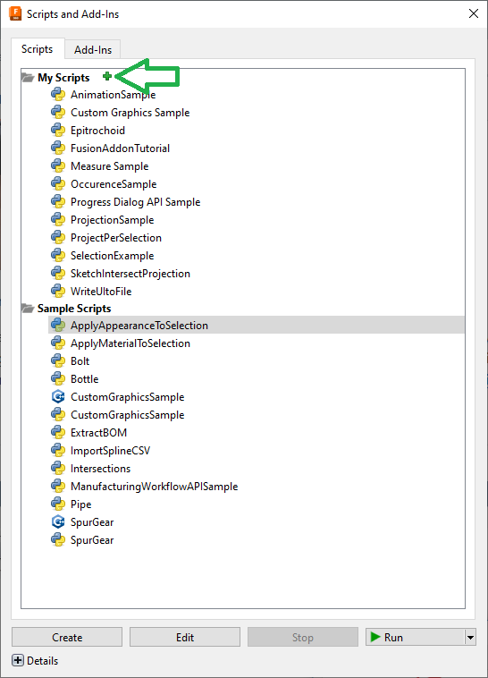

# Epitrochoid Fusion360 Script

## What is an Epitrochoid?
Best is to take a look on the [Wikipedia](https://en.m.wikipedia.org/wiki/Epitrochoid)

## How to install the script
The script is a Python script.
First you must donwload the source code.

Copy it to a place at your wish. Maybe the best place is the script directory of fusion360. You can find this directory when you open the script manager and try to add a new script (see below).

In Fusion360 go to the Utilities Tab and start the script manager

Inside the Manager klick at the green plus

## Run the script
Once you installed the script you can start it inside the script manager.

Change the values to create the shape you want.

######################################

## Some Ideas
- The radius sliders are not good to handle. This must be changed.
- The script saves the values as attributes in the sketch. Maybe we add a function to change a created sketch.